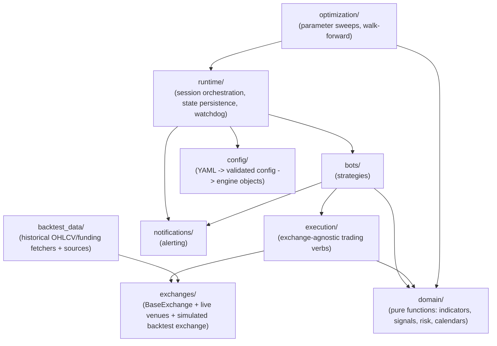

# Lighthouse: algorithmic trading infrastructure

[](https://github.com/matthijsnij/algotrading-infra/actions/workflows/tests.yml)

Asset-agnostic trading infrastructure. The same bot code runs in backtest, on exchange
testnet, and live, with no rewrites between stages.

## Architecture



| Package | Responsibility |
| --- | --- |
| `domain/` | Pure functions and value types over market data: indicators, signals, risk, instruments, holiday-aware trading calendars. No I/O. |
| `execution/` | Exchange-agnostic trading verbs: fetching data, placing orders, reading positions. |
| `exchanges/` | The `BaseExchange` contract, live venue implementations (Phemex, Alpaca), and a simulated backtest exchange with its own fill engine and funding models. |
| `bots/` | Strategy base classes and the tick/scan/position/halt/reconcile lifecycle. |
| `runtime/` | Session orchestration (live and backtest), SQLite state persistence + reconciliation, and a watchdog that auto-restarts halted bot threads. |
| `config/` | YAML configs, validated with pydantic, translated into the engine objects above. |
| `notifications/` | Alerting (e.g. Telegram) wired into bot lifecycle events. |
| `optimization/` | Parameter sweeps, objectives, and walk-forward analysis. |
| `backtest_data/` | Historical OHLCV/funding fetchers and file-backed sources. Storage locations are supplied by the caller. |
| `utils/` | Shared utilities: logging setup, path resolution, timeframe parsing, validation. |

## Highlights

- **Simulated backtest exchange**, with a fill engine, order book, and per-exchange
  funding models, run against the same `BaseExchange` interface a bot sees live.
- **Walk-forward optimization**: parameter sweeps validated out-of-sample across rolling
  windows, not just a single in-sample fit.
- **Holiday-aware trading calendars**, for correctness on non-24/7, holiday-observing
  markets, not just crypto.
- **State persistence, reconciliation and watchdog restarts**: bot state survives process
  restarts, `reconcile()` checks the exchange for orphaned positions/orders before a bot
  resumes, and a watchdog auto-restarts halted bots within a restart budget.
- **Registries and factories**: new exchanges and bots plug in by subclassing
  `BaseExchange`/`BaseBot` and registering, with no changes to shared orchestration code.
- **Documented design decisions**: architecture decision records (`docs/adr/`) and a
  domain glossary (`CONTEXT.md`) record why the tricky parts (entry failure backoff,
  same-bar re-entry, reconciliation trust boundaries) work the way they do.
- **874 tests**, all offline, with no real exchange, broker, or notification network calls.

## Example Bots

Two example bots are included as minimal, complete reference implementations of the bot
lifecycle, not as trading strategy recommendations:

- **CryptoBot** (`bots/examples/crypto_bot/`): a 24/7 range-breakout strategy on
  BTC/USDT, with ATR/volume filters and ATR-based stop-loss/take-profit orders.
- **StockBot** (`bots/examples/stock_bot/`): a long-only 20/50 moving-average crossover
  strategy on daily AAPL bars, sized with `domain/risk.py`'s fixed-fractional helper.

Both live exchanges (Phemex, Alpaca) are unit-tested.

## Install

```bash
pip install -e ".[dev]"
```

---

All rights reserved. No permission is granted to use, copy, modify or distribute this
software.

